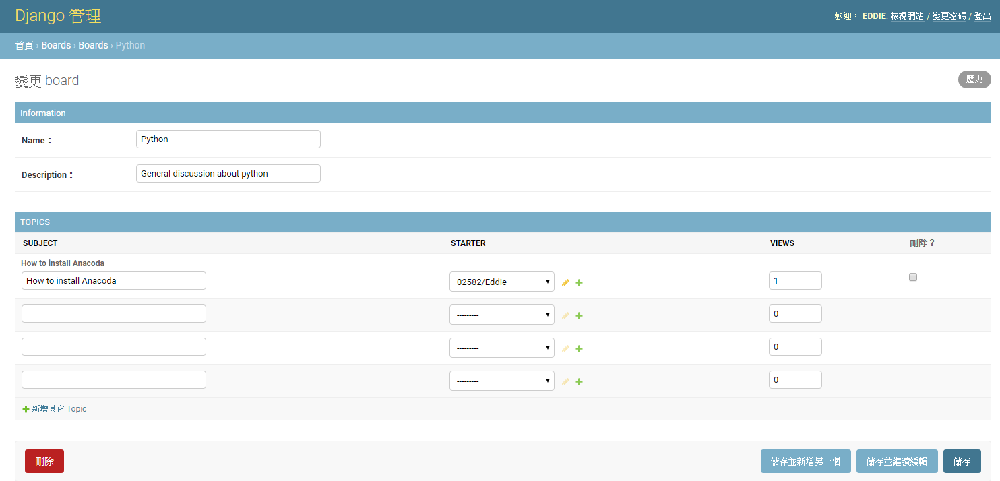

# Admin


model.py如下,Topics ForeignKey Board


```python 
from django.db import models
from django.contrib.auth.models import User
class Board(models.Model):
    name = models.CharField(max_length=30, unique=True)
    description = models.CharField(max_length=100)
    def __str__(self):
        return self.name
    def get_posts_count(self):
        return Post.objects.filter(topic__board=self).count()

    def get_last_post(self):
        return Post.objects.filter(topic__board=self).order_by('-created_at').first()	
		
class Topic(models.Model):
    subject = models.CharField(max_length=255)
    last_updated = models.DateTimeField(auto_now_add=True)
    board = models.ForeignKey(Board, related_name='topics',on_delete=models.CASCADE)
    starter = models.ForeignKey(User, related_name='topics',on_delete=models.CASCADE)
    views = models.PositiveIntegerField(default=0)
    def __str__(self):
        return self.subject
    def get_starter(self):
        return starter.__fullname__()
        
```


## 註冊 model
admin.py 透過 admin.site.register 註冊 Profile


```python 
from django.contrib import admin
from .models import Board
admin.site.register(Board)
```

顯示介面如下


編輯介面如下


## 自訂 編輯格式
建立一個BoardAdmin 的class ,繼承admin.ModelAdmin<br>
透過 admin.site.register(Board,BoardAdmin) 修改admin格式


#### 修改編輯欄位
fields 自訂顯示編輯欄位
```python 
class Profiledmin(admin.ModelAdmin):    
    fields = ['name','description']

admin.site.register(Board,BoardAdmin)
```

fieldsets 顯示編輯欄位title,注意fieldsets/fields 只能選一

```python 
class Profiledmin(admin.ModelAdmin):   
    
    fieldsets = [
        ("Information", {'fields': ['name','description']}),       
    ]

```


#### 關聯式資料
透過inlines將兩種資料庫連接,有兩種堆疊方式StackedInline,TabularInline


##### ForeignKey
這邊incline 有2種方式TabularInline和StackedInline 顯示方式

```python 
class Topic_Incline(admin.TabularInline):
    model = Topic
    extra = 3	

class Boarddmin(admin.ModelAdmin):   
    fieldsets = [
        ("Information", {'fields': ['name','description']}),       
    ]		
    inlines = [Topic_Incline]	
    
admin.site.register(Board,BoardAdmin)
```

<ul>
    <li>TabularInline 顯示</li>
    <li>StackedInline 顯示</li>
</ul>
StackedInline 顯示


如何固定extra個數,修改get_extra函數


```python 
class Topic_Incline(admin.TabularInline):
    model = Topic     
    def get_extra(self, request, obj=None, **kwargs):
        extra = 3
        if obj:            
            #return extra - Topic.objects.filter(board = obj).count()   
            return extra - obj.topics.count()        
        return extra		
	
```

如何固定出始値

```python 
from django.forms.models import BaseInlineFormSet

class TopicFormset(BaseInlineFormSet):
    def __init__(self, *args, **kwargs):
        kwargs['initial'] = [
            {'subject': '恭喜開版'}, {'subject': 'HV'}, {'subject': 'LV'}
        ]
        super(TopicFormset, self).__init__(*args, **kwargs)


class Topic_Incline(admin.TabularInline):
    model = Topic 
    formset = TopicFormset
    def get_extra(self, request, obj=None, **kwargs):
        extra = 3
        if obj:            
            #return extra - Topic.objects.filter(board = obj).count()   
            return extra - obj.topics.count()
        return extra	
        
```
##### OneToOneField

請參考此連結<a href = "https://github.com/Eddie02582/Django-tutorial/tree/master/Advanced/Admin%20User%20Modify#incline">OneToOneField</a>

##### ManyToMany
修改ManyToMany 編輯顯示方式

```python 
class AuthorAdmin(admin.ModelAdmin):  
    
    fields = ['project','starter','owner_rd','rf_rd','power_rd','pl','notify']

    
    #fields = ['project']    
    def formfield_for_manytomany(self, db_field, request, **kwargs):
         vertical = False  # change to True if you prefer boxes to be stacked vertically
         kwargs['widget'] = FilteredSelectMultiple(
             db_field.verbose_name,
             vertical,
         )
         return super().formfield_for_manytomany(db_field, request, **kwargs)
```

## 顯示介面


#### 修改顯示欄位(list_display)
這邊以Topic 示範<br>


可以透過model.py 新增顯示欄位
```python 
class TopicAdmin(admin.ModelAdmin):
    list_display=['board','subject','views']
    
```

也可以透過admin.py 新增
```python 
class TopicAdmin(admin.ModelAdmin):
    list_display=['board','subject','views','get_post_count']
  
    def get_post_count(self,obj):
        return obj.posts.count()  
    get_post_count.short_description = 'Posts Count'
```


#### 新增排序(ordering)
使用turple() or list []都可以,如果使用turple,要注意只有一個値後面要用逗號

```python 
    ordering = ('board__name',)
```

#### 新增收尋(search_fields)
```python 
    search_fields=['subject']
```

#### 新增過濾欄位(list_filter)
```python 
    list_filter=['board__name']	
```


完整code
```python 
class TopicAdmin(admin.ModelAdmin):
    list_display=['board','subject','views','get_post_count']
    ordering = ('board__name',)
    search_fields=['subject']
    list_filter=['board__name']	
    def get_post_count(self,obj):
        return obj.posts.count()  
    get_post_count.short_description = 'Posts Count'
```


