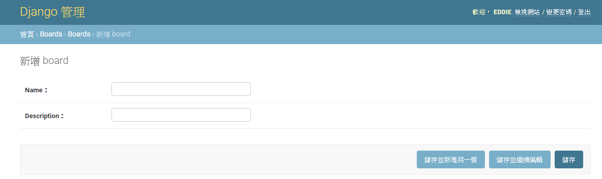
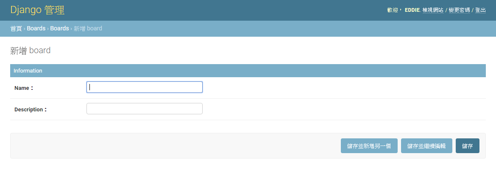

# Admin


model.py
```python 

from django.contrib import admin
from .models import Question

class Profile(models.Model):
    user = models.OneToOneField(User, on_delete=models.CASCADE)
    Team_CHOICES = (
        ('PL', 'PL'),       
		('HW', 'HW'), 
		('Layout', 'Layout'), 
		('Validation', 'Validation'),
        ('Antenna', 'Antenna'),
		('Automation', 'Automation'), 
        ('Driver', 'Driver'), 
        ('Sales', 'Sales'), 
		('Others', 'Others'),  			
	) 	
	
    Team = models.CharField(max_length=30,default='Others',choices=Team_CHOICES)
    Ext = models.CharField(max_length=30,null=True,blank=True,default="")	
    Short_number= models.CharField(max_length=30,null=True,blank=True,default="")	
    Cellphone_number= models.CharField(max_length=30,null=True,blank=True,default="")
    WeChat_ID= models.CharField(max_length=30,null=True,blank=True,default="")	
    Supervisor =  models.ForeignKey(User, on_delete=models.SET_NULL,related_name="+",null=True,blank=True)   
    incumbent = models.BooleanField(default=True)
```


## 簡單註冊 model
admin.py 透過 admin.site.register 註冊 Profile


```python 
from django.contrib import admin
from django.contrib.auth.models import User
from .models import Profile

admin.site.register(Profile)

```


## 自訂 編輯形式
透過 admin.site.register(Profile,Profiledmin) 修改admin格式,Profiledmin為自訂內容


#### 修改編輯欄位
透過field 自訂顯示編輯欄位
```python 
class Profiledmin(admin.ModelAdmin):    
    fields = ['user','Team','Ext']

admin.site.register(Profile,Profiledmin)
```



透過fieldsets 顯示編輯欄位title

```python 
class Profiledmin(admin.ModelAdmin):   
    
    fieldsets = [
        ("Information", {'fields': ['Team','Supervisor','incumbent']}),
        ('Contact information', {'fields': ['Ext','Cellphone_number','Short_number','WeChat_ID']}),
    ]

```



#### 關聯式資料


