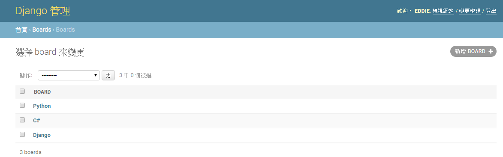
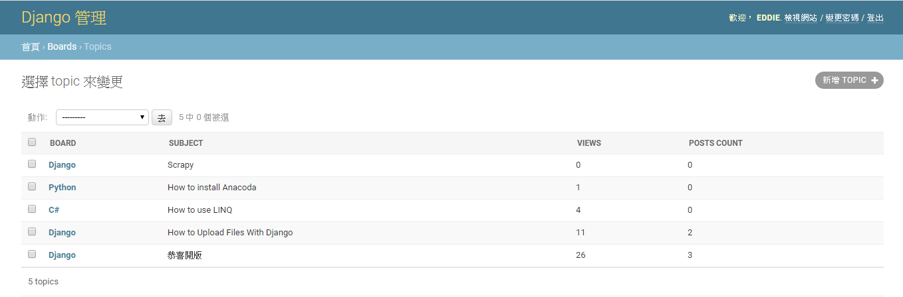

# Admin


model.py
```python 

from django.contrib import admin
from .models import Question

class Profile(models.Model):
    user = models.OneToOneField(User, on_delete=models.CASCADE)
    Team_CHOICES = (
        ('PL', 'PL'),       
		('HW', 'HW'), 
		('Layout', 'Layout'), 
		('Validation', 'Validation'),
        ('Antenna', 'Antenna'),
		('Automation', 'Automation'), 
        ('Driver', 'Driver'), 
        ('Sales', 'Sales'), 
		('Others', 'Others'),  			
	) 	
	
    Team = models.CharField(max_length=30,default='Others',choices=Team_CHOICES)
    Ext = models.CharField(max_length=30,null=True,blank=True,default="")	
    Short_number= models.CharField(max_length=30,null=True,blank=True,default="")	
    Cellphone_number= models.CharField(max_length=30,null=True,blank=True,default="")
    WeChat_ID= models.CharField(max_length=30,null=True,blank=True,default="")	
    Supervisor =  models.ForeignKey(User, on_delete=models.SET_NULL,related_name="+",null=True,blank=True)   
    incumbent = models.BooleanField(default=True)
```


## 簡單註冊 model
admin.py 透過 admin.site.register 註冊 Profile


```python 
from django.contrib import admin
from django.contrib.auth.models import User
from .models import Profile

admin.site.register(Profile)

```




## 自訂 編輯形式
透過 admin.site.register(Profile,Profiledmin) 修改admin格式,Profiledmin為自訂內容


#### 修改編輯欄位
透過field 自訂顯示編輯欄位
```python 
class Profiledmin(admin.ModelAdmin):    
    fields = ['user','Team','Ext']

admin.site.register(Profile,Profiledmin)
```


透過fieldsets 顯示編輯欄位title

```python 
class Profiledmin(admin.ModelAdmin):   
    
    fieldsets = [
        ("Information", {'fields': ['Team','Supervisor','incumbent']}),
        ('Contact information', {'fields': ['Ext','Cellphone_number','Short_number','WeChat_ID']}),
    ]

```


#### 關聯式資料
透過inlines將兩種資料庫連接,有兩種堆疊方式StackedInline,TabularInline


##### OneToOneField
我們建立一個Profile 對User使用 OneToOneField 擴充,希望能在User 建立介面能一起建立Profile

```python 
class ProfileInline(admin.StackedInline):
    model = Profile   
    verbose_name_plural = 'Profile'
    fk_name = 'user'

    fieldsets = [
        ("Information", {'fields': ['Team','Supervisor','incumbent']}),
        ('Contact information', {'fields': ['Ext','Cellphone_number','Short_number','WeChat_ID']}),
    ]

class CustomUserAdmin(UserAdmin):
    inlines = (ProfileInline, )
admin.site.unregister(User)
admin.site.register(User, CustomUserAdmin)
```

StackedInline


TabularInline


##### ForeignKey
```python 

class ChoiceInline(admin.StackedInline):
    model = Choice
    extra = 3

class QuestionAdmin(admin.ModelAdmin):
    fieldsets = [
    (None, {'fields': ['question_text']}),
    ('Date information', {'fields': ['pub_date'], 'classes': ['collapse']}),
    ]
    inlines = [ChoiceInline]
    
admin.site.register(Question, QuestionAdmin)
```

如何固定extra,注意choice_set 這邊取決於model related_name 設定,

```python 
class ChoiceInline(admin.TabularInline):
    model = Choice    

    def get_extra(self, request, obj=None, **kwargs):
        extra = 3
        if obj:            
            return extra - obj.choice_set.count()
        return extra	
```

給定ForeignKey出始値

```python 
from django.forms.models import BaseInlineFormSet

class ChoiceFormset(BaseInlineFormSet):
    def __init__(self, *args, **kwargs):
        kwargs['initial'] = [
            {'name': 'n1'}, {'name': 'n2'}, {'name': 'n3'}
        ]
        super(TempResultFormset, self).__init__(*args, **kwargs)


class ChoiceInline(admin.TabularInline):
    model = Choice    
    formset = ChoiceFormset
    def get_extra(self, request, obj=None, **kwargs):
        extra = 3
        if obj:            
            return extra - obj.choice_set.count()
        return extra	
```

##### ManyToMany
修改ManyToMany 顯示方式

```python 
class AuthorAdmin(admin.ModelAdmin):  
    
    fields = ['project','starter','owner_rd','rf_rd','power_rd','pl','notify']

    
    #fields = ['project']    
    def formfield_for_manytomany(self, db_field, request, **kwargs):
         vertical = False  # change to True if you prefer boxes to be stacked vertically
         kwargs['widget'] = FilteredSelectMultiple(
             db_field.verbose_name,
             vertical,
         )
         return super().formfield_for_manytomany(db_field, request, **kwargs)
```

## 顯示介面


#### 修改顯示欄位(list_display)


```python 
class CustomUserAdmin(UserAdmin):
    inlines = (ProfileInline, )    
    list_display = ('username','Team','last_login')
    
    def Team(self,obj):
        return obj.profile.Team    
    
```

或者
```python 
class CustomUserAdmin(UserAdmin):
    inlines = (ProfileInline, )    
    list_display = ('username','get_profile_team','last_login')
    
    def get_profile_team(self,obj):
        return obj.profile.Team    
    get_profile_team.short_description = 'Team'
```




#### 新增排序(ordering)

```python 
    ordering = ('username',)
```

#### 新增收尋(search_fields)
```python 
    search_fields=('Team',)
```

#### 新增過濾欄位(list_filter)
```python 
    list_filter=('profile__Team',)
```


完整code
```python 
class CustomUserAdmin(UserAdmin):
    inlines = (ProfileInline, )
    #list_display = ('username','Team','__str__','email','Ext','Supervisor','last_login')
    list_display = ('username','Team','last_login')
    ordering = ('username',)
    search_fields=('Team',)
    list_filter=('profile__Team',)
    # def get_inline_instances(self, request, obj=None):
    #     if not obj:
    #         return list()
    #     return super(CustomUserAdmin, self).get_inline_instances(request, obj)

    def Team(self,obj):
        return obj.profile.Team

    def Supervisor(self,obj):
        return obj.profile.Supervisor
 
    def Ext(self,obj):
        return obj.profile.Ext
```


