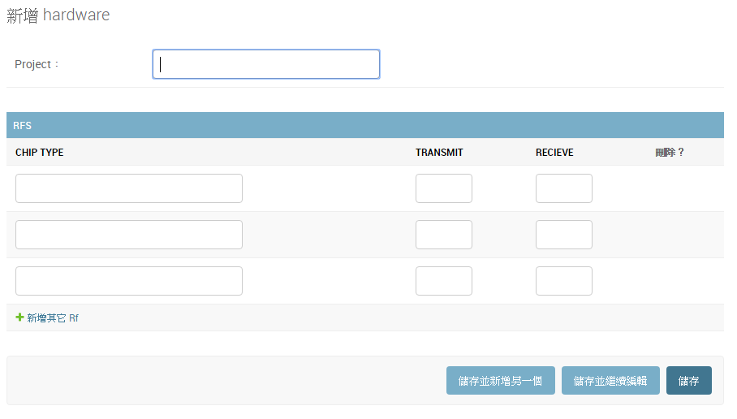
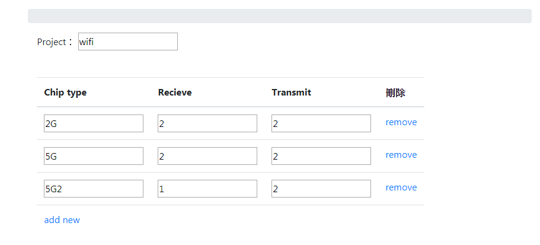

# Django inline formsets with Class-based 

<a href = "https://dev.to/zxenia/django-inline-formsets-with-class-based-views-and-crispy-forms-14o6">原文參考 </a>

我們想在網頁上使用跟admin 管理一樣 incline </br>




### Model with ForeignKey

一個wifi 的案子,裡面RF Band Number 可能會不只一個,多個RF會對應其project,是一對多的問題,假設模型如下　</br>

```python
from django.db import models
# Create your models here.


class Hardware(models.Model):
    project = models.CharField(max_length=100,null=False,blank=True) 

    def __str__(self):
        return self.project

class RF(models.Model):  
    chip_type = models.CharField(max_length=100)    
    transmit = models.IntegerField()
    recieve = models.IntegerField()
    hardware  = models.ForeignKey(Hardware, related_name='+', on_delete=models.CASCADE,null=True)
```


### FormSet 
使用inlineformset_factory 建立 FormSet


```python
from django import forms
from .models import Hardware,RF
from django.forms import inlineformset_factory

class HardwareConfigForm(forms.ModelForm):   
    class Meta:       
        model = Hardware         
        fields=['project']

class RFForm(forms.ModelForm):   
    class Meta:       
        model = RF 
        fields='__all__' 
  
RFFormSet = inlineformset_factory(
    Hardware,RF, form=RFForm,
    extra=3, can_delete=True
    )

```

下面介紹inlineformset_factory 其他可用參數
```
inlineformset_factory(parent_model, model, form=ModelForm, formset=BaseInlineFormSet, f
k_name=None, fields=None, exclude=None, extra=3, can_order=False, 
can_delete=True, max_num=None, formfield_callback=None, widgets=None, 
validate_max=False, localized_fields=None, labels=None, help_texts=None,
 error_messages=None, min_num=None, validate_min=False, field_classes=None
```


### View函數

```python
class HWConfig(CreateView):
    model = Hardware
    form_class=HardwareConfigForm	
  

    def get_context_data(self, **kwargs):
        data = super(HWConfig, self).get_context_data(**kwargs)
        if self.request.POST:
            data['incline_form'] = RFFormSet(self.request.POST)
        else:
            data['incline_form'] = RFFormSet()
        return data

    def form_valid(self, form):
        context = self.get_context_data()
        RF_Member = context['incline_form']
        
        with transaction.atomic():
            self.object = form.save()
            if RF_Member.is_valid():
                RF_Member.instance = self.object
                RF_Member.save()
                
        return super(HWConfig, self).form_valid(form)

```


### Template 

``` html





<div class="col-md-4">
    <form action="" method="post">
        {{ form.as_p }}       
        
        <table class="table">            
            {{ incline_form.management_form }}
            
                
                    <thead>
                    <tr>
                        
                            <th>{{ field.label|capfirst }}</th>
                        
                    </tr>
                    </thead>
                
                <tr class=" formset_row">
                    
                        <td>
                            {# Include the hidden fields in the form #}
                            
                                
                                    {{ hidden }}
                                
                            
                            {{ field.errors.as_ul }}
                            {{ field }}
                        </td>
                    
                </tr>
            
        </table>        
    </form>
</div>
<script src="//ajax.googleapis.com/ajax/libs/jquery/2.1.3/jquery.min.js"></script>
<script src=""></script>
<script type="text/javascript">
    $('.formset_row').formset({
        addText: 'add new',
        deleteText: 'remove',
        prefix: 'familymember_set'
    });
</script>

```

### Result



