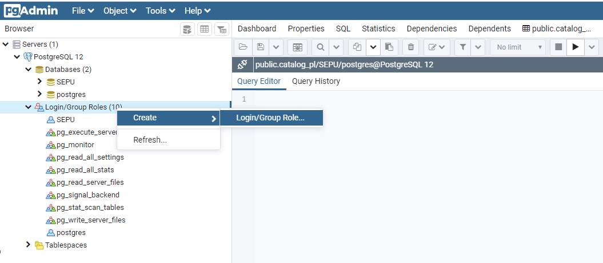

# Migrate DataBase from SQLite to PostgreSQL

這邊以SQLite to PostgreSQL

有幾個步驟

## 正常做法

### Dump data
將資料dump 出來
```
python manage.py dumpdata > db.json
```

### 建立PostgreSQL DataBase
這邊使用pgAdmin建立<br>
#### 先建立使用者
步驟如下


設定使用者名稱

設定密碼

設定權限


#### 建立資料庫


設定資料庫名稱 和對應使用者


### 修改 setting.py
```
DATABASES = {
    'default': {
        'ENGINE': 'django.db.backends.postgresql_psycopg2',
        'NAME': 'Test',
        'USER': 'Eddie',
        'PASSWORD': '12345',
        'HOST': 'localhost',
        'PORT': '',
    }
}
```


### 遷移資料庫
```
python manage migrate
```

### 修復資料
```
python manage shell
from django.contrib.contenttypes.models import ContentType
ContentType.objects.all().delete()
quit()
```

### 將資料載入進資料庫
```
python manage.py loaddata db.json
```