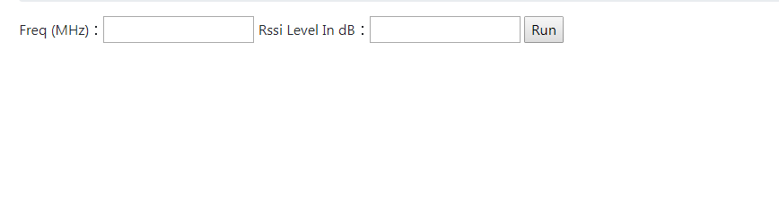

# Form

主要分成兩大類
<ul>
    <li>Form</li>
    <li>MdoelForm</li>
</ul>


## Form
自行定義form 表單欄位,在form.py 定義

這邊設定欄位required=True,所以在進行表單驗證時,欄位必須需要填寫,才會驗證成功
**form.py**
```python 
from django import forms			 
class APLossForm(forms.Form):
    FreqInMHz  = forms.FloatField(label='Freq (MHz)', required=True)
    levelInDb = forms.FloatField(label='Rssi Level In dB', required=True)
```

### View 
這邊分別介紹兩種view 函數的方法FBV 和CBV,詳情可以參考<a href = "https://github.com/Eddie02582/Django-tutorial/tree/master/View/FBV%20vs%20CBV">FBV VS CBV</a>

#### FBV 
這邊有幾個重點
<ul>
    <li>form = APLossForm()</li>
    <li>form = APLossForm(request.POST)取得form POST 的資料</li>
    <li>form.is_valid() 用來驗證表單資料是否正確</li>
    <li>form.cleaned_data[field] 取得資料(field 對應form.py欄位)</li>
</ul>

**view.py**
```python 
def ApLoss_View(request):	
    form = APLossForm()  
    if request.method == 'POST':
        form = APLossForm(request.POST)	
        if form.is_valid():             
            Freq = form.cleaned_data.get('FreqInMHz')         
            levelInDb = form.cleaned_data['levelInDb']
            result = (27.55 - (20 * math.log10(Freq)) + math.fabs(levelInDb)) / 20.0
            meters = math.pow(10, result)       
            feet = meters * 3.2808            	    
            return render(request, 'APLoss.html', {'form': form,'feet':feet,'meters':meters})		        
    else:        
        return render(request, 'APLoss.html', {'form': form})	

```


#### CBV
這邊有幾個重點
<ul>
    <li>form_class 指定 form格式</li>
    <li>template_name 指定 模版</li>
    <li>form_valid 如果資料驗證成功會執行的函數</li>   
</ul>

**view.py**
```python 

class ApLoss_View(FormView):
    form_class = APLossForm  
    template_name = 'APLoss.html'
	
    def form_valid(self, form):        
        Freq = form.cleaned_data.get('FreqInMHz')         
        levelInDb = form.cleaned_data['levelInDb']
        result = (27.55 - (20 * math.log10(Freq)) + math.fabs(levelInDb)) / 20.0
        meters = math.pow(10, result)       
        feet = meters * 3.2808            	    
        return render(self.request, 'APLoss.html', {'form': form,'feet':feet,'meters':meters})
```


### html


##### form.as_p

**html**
```html
<form enctype="form-data" action="" method="post">
    	
	{{form.as_p}}	
    <input type="submit" value="Run">		
</form>

	feet: {{feet}}<br>
	meters: {{meters}} <br>

```


#### form.as_table

**html**
```html
<form enctype="form-data" action="" method="post">
    	
	{{form.as_table}}	
    <input type="submit" value="Run">		
</form>

	feet: {{feet}}<br>
	meters: {{meters}} <br>

```



#### form.field
也可以自訂顯示
```html
<form enctype="form-data" action="" method="post">
    
	<div class="form-group ">
		 {{form.FreqInMHz.label}} {{form.FreqInMHz}} 				
	</div>	
	
	<div class="form-group ">
		 {{form.levelInDb.label}} {{form.levelInDb}} 				
	</div> 	
    <input type="submit" value="Run">	
	
</form>
```


## ModelForm
假設有一個Model

**model.py**

```python 
class Task(models.Model):

    Status_CHOICES = (
        ('Close', 'Close'),       
		('Open', 'Open'),         
    )   
    name = models.CharField(max_length=200,blank=True,default="") 

    start_date = models.DateField(default=timezone.now,null=True,blank=True)	  	
    end_date = models.DateField(null=True,blank=True)	 

    owner = models.ForeignKey(User, on_delete=models.CASCADE)

    note = TextField(max_length=8000,blank=True,default="")    
    status = models.CharField(max_length=10, null=False,choices=Status_CHOICES,default='Open')
    upload = models.FileField(upload_to=user_directory_path,null=True,blank=True) 
   

```

不使用form.py <br>
**view.py**

```python 
class AuthorCreate(CreateView):
    model = Task
    fields = ['name','status','start_date','end_date','note','upload']
    def form_valid(self, form):
        form.instance.owner = self.request.user
        return super().form_valid(form)
```

**form.py**
使用fields 指定表單model 的欄位

```python 
class TaskForm(forms.ModelForm): 
    class Meta:       
        model = Task         
        fields = ['name','status','start_date','end_date','note','upload']
        #fields = "__al__"
```

**view.py**

也可以使用FBV
```python 
class AuthorCreate(CreateView):
    model = Task
    form = TaskForm
    def form_valid(self, form):
        tasks = form.save(commit=False)
        tasks.owner = self.request.user
        #tasks.save()        
        return super().form_valid(form)
```


進階修改欄位
 
 

```python 
class CommentForm(forms.ModelForm): 
owner= forms.ModelMultipleChoiceField(queryset=User.objects.filter(groups=Group.objects.get(name='RD')),                                            
                                              widget=FilteredSelectMultiple("Validation Staff", is_stacked=False), required=False)	  
start_date= forms.DateField(widget=forms.DateInput(attrs={'type': 'date'},format=('%Y-%m-%d')), required=False)	
upload = forms.FileField(widget=forms.ClearableFileInput(attrs={'multiple': True}), required=False) 
    class Meta:       
        model = Comment         
        fields = ['name','start_date','owner','note']
        #fields = "__al__"
```

修改widgets
 
 
 ```python 
class CommentForm(forms.ModelForm): 
owner= forms.ModelMultipleChoiceField(queryset=User.objects.filter(groups=Group.objects.get(name='RD')),                                            
                                              widget=FilteredSelectMultiple("Validation Staff", is_stacked=False), required=False)	  
start_date= forms.DateField(widget=forms.DateInput(attrs={'type': 'date'},format=('%Y-%m-%d')), required=False)	
upload = forms.FileField(widget=forms.ClearableFileInput(attrs={'multiple': True}), required=False) 
    class Meta:       
        model = Comment         
        fields = ['name','start_date','owner','note']
        widgets = { 
            'note': forms.Textarea(attrs={'cols': 120,'rows':10}),          
		}
```

## 自訂form error

 ```python 
class ResourceForm(forms.Form):   
     
    start_date = forms.DateField(widget=forms.DateInput(attrs={'type': 'date'},format=('%Y-%m-%d')), required=True,initial=GetMonthFirstDay())	
    end_date = forms.DateField(label='結束日期',widget=forms.DateInput(attrs={'type': 'date'},format=('%Y-%m-%d')), required=True)	 

    def clean(self):   
        # data from the form is fetched using super function 
        cleaned_data  = super(ResourceForm, self).clean()  
        start_date = cleaned_data.get('start_date') 
        end_date = cleaned_data.get('end_date') 
        if not end_date>=start_date:            
            #self._errors['end_date'] = self.error_class(['End date must be greater than start date']) 
            #self.add_error('end_date', "End date must be greater than start date")
            raise forms.ValidationError("End date must be greater than start date")
        return cleaned_data 

```
指定欄位
 ```python 
    def clean_start_date(self):   
        # data from the form is fetched using super function 
        cleaned_data  = super(ResourceForm, self).clean()  
        start_date = cleaned_data.get('start_date') 
        end_date = cleaned_data.get('end_date') 
        if not end_date>=start_date:    
            raise forms.ValidationError("End date must be greater than start date")
        return cleaned_data 

```

