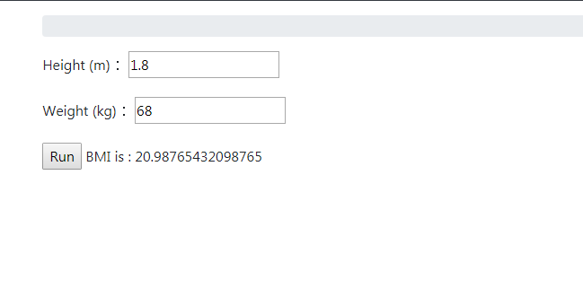

# Form

主要分成兩大類
<ul>
    <li>Form</li>
    <li>MdoelForm</li>
</ul>


## Form

建立簡的form

form.py
```python 

from django import forms
			 
class BMIForm(forms.Form):
    Height  = forms.FloatField(label='Height (m)', required=True)
    Weight = forms.FloatField(label='Weight (kg)', required=True)

```

html
```html
<form enctype="multipart/form-data" action="" method="post">
    
    {{form.as_p}}	
        <input type="submit" value="Run">	
	
        BMI is : {{bmi}}
	 	
</form>
```

網頁顯示



## ModelForm
假設有一個Model

model.py
```python 
class Task(models.Model):

    Status_CHOICES = (
        ('Close', 'Close'),       
		('Open', 'Open'),         
    )    
 
    
    name = models.CharField(max_length=200,blank=True,default="") 

    start_date = models.DateField(default=timezone.now,null=True,blank=True)	  	
    end_date = models.DateField(null=True,blank=True)	 

    owner= models.ManyToManyField(User,related_name='+',blank=True)

    note = TextField(max_length=8000,blank=True,default="")    
    status = models.CharField(max_length=10, null=False,choices=Status_CHOICES,default='Open')
    upload = models.FileField(upload_to=user_directory_path,null=True,blank=True) 
    owner = models.ManyToManyField(User,related_name='+',blank=True)  

```

form.py
使用fields 指定表單model 的欄位

```python 
class CommentForm(forms.ModelForm): 
    class Meta:       
        model = Comment         
        fields = ['name','start_date','owner','note']
        #fields = "__al__"
```


進階修改欄位
 
 

```python 
class CommentForm(forms.ModelForm): 
owner= forms.ModelMultipleChoiceField(queryset=User.objects.filter(groups=Group.objects.get(name='RD')),                                            
                                              widget=FilteredSelectMultiple("Validation Staff", is_stacked=False), required=False)	  
start_date= forms.DateField(widget=forms.DateInput(attrs={'type': 'date'},format=('%Y-%m-%d')), required=False)	
upload = forms.FileField(widget=forms.ClearableFileInput(attrs={'multiple': True}), required=False) 
    class Meta:       
        model = Comment         
        fields = ['name','start_date','owner','note']
        #fields = "__al__"
```

修改widgets
 
 
 ```python 
class CommentForm(forms.ModelForm): 
owner= forms.ModelMultipleChoiceField(queryset=User.objects.filter(groups=Group.objects.get(name='RD')),                                            
                                              widget=FilteredSelectMultiple("Validation Staff", is_stacked=False), required=False)	  
start_date= forms.DateField(widget=forms.DateInput(attrs={'type': 'date'},format=('%Y-%m-%d')), required=False)	
upload = forms.FileField(widget=forms.ClearableFileInput(attrs={'multiple': True}), required=False) 
    class Meta:       
        model = Comment         
        fields = ['name','start_date','owner','note']
        widgets = { 
            'note': forms.Textarea(attrs={'cols': 120,'rows':10}),          
		}
```

### 自訂form error

 ```python 
class ResourceForm(forms.Form):   
     
    start_date = forms.DateField(widget=forms.DateInput(attrs={'type': 'date'},format=('%Y-%m-%d')), required=True,initial=GetMonthFirstDay())	
    end_date = forms.DateField(label='結束日期',widget=forms.DateInput(attrs={'type': 'date'},format=('%Y-%m-%d')), required=True)	 

    def clean(self):   
        # data from the form is fetched using super function 
        cleaned_data  = super(ResourceForm, self).clean()  
        start_date = self.cleaned_data.get('start_date') 
        end_date = self.cleaned_data.get('end_date') 
        if not end_date>=start_date:            
            #self._errors['end_date'] = self.error_class(['End date must be greater than start date']) 
            #self.add_error('end_date', "End date must be greater than start date")
            raise forms.ValidationError("End date must be greater than start date")
        return cleaned_data 

```

