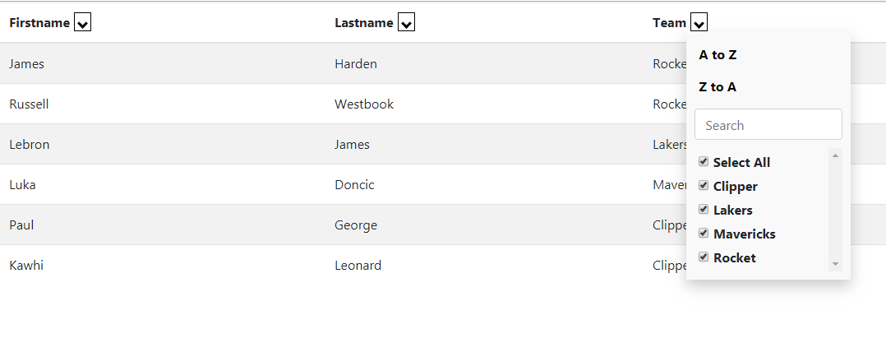

# Freeze Table

<a href = https://github.com/chestercharles/excel-bootstrap-table-filter>參考 chestercharles github </a>

 


## 如何使用

#### 1. Include css/script

```html
<script src="excel-bootstrap-table-filter-bundle.js"></script>
<link rel="stylesheet" href="excel-bootstrap-table-filter-style.css">
```

#### 2. Add javasctipt
指定要excelTableFilter的table

```html
 <script>
    $('#table-info').excelTableFilter();
  </script> 
```


