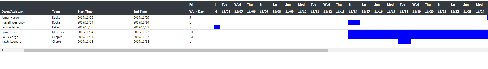

# Freeze Table


<a href = https://github.com/yidas/jquery-freeze-table>參考 yidas github </a>


 


## 如何使用


#### 1. Include script

```html
<script src="freeze-table.js"></script>
```


#### 2. html Add javasctipt
預設設定為固定第一欄<br>
若想要固定Column,將freezeColumn 設定為true,並指定要凍結的個數(columnNum)


 ``` javascript
    $(document).ready(function() {      
        $(".table-scrollable").freezeTable({         
          'freezeColumn':true,
          'columnNum':5,
        }); 
     });
```


### 3. html
在table 前面新增 div 

 ``` html
   <div class="table-scrollable" style="overflow-x: auto">  
        <table>
            ......
        </tablee>
   
   </div>
```


