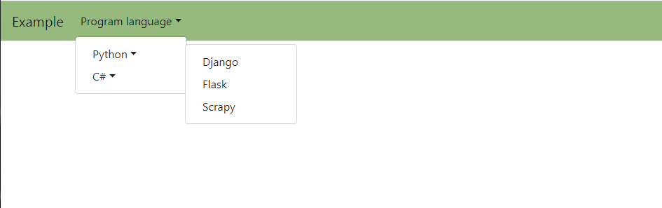

# NavBar Muility Layer


 


## 如何使用


#### 1. Include script

```html
<script src="bootstrap-4-navbar.min.js"></script>
```


### 2. html
在table 前面新增 div 

 ``` html
<nav class="navbar navbar-expand-sm navbar-light" style="background: #96b97d;">
    <a class="navbar-brand" href="#">Example</a> 
    <button class="navbar-toggler" type="button" data-toggle="collapse" data-target="#mainMenu" aria-controls="mainMenu" aria-expanded="false" aria-label="Toggle navigation">
      <span class="navbar-toggler-icon"></span>
    </button>
    <div class="collapse navbar-collapse" id="navbarNavDropdown">
      <ul class="navbar-nav">   
          <li class="nav-item dropdown">
              <a class="nav-link dropdown-toggle"  id="navbarDropdownMenuLink" data-toggle="dropdown" aria-haspopup="true" aria-expanded="false">Program language</a>
              <ul class="dropdown-menu dropdown-menu-right" aria-labelledby="navbarDropdownMenuLink">                  
                  <li><a class="dropdown-item dropdown-toggle" href="#">Python</a>
                      <ul class="dropdown-menu dropdown-menu-right">
                          <li><a class="dropdown-item" href="#">Django</a></li>
                          <li><a class="dropdown-item" href="#">Flask</a></li>
                          <li><a class="dropdown-item" href="#">Scrapy</a></li>                    
                      </ul>
                  </li>
                  <li><a class="dropdown-item dropdown-toggle" href="#">C#</a>
                      <ul class="dropdown-menu dropdown-menu-right">
                          <li><a class="dropdown-item" href="#">LINQ</a></li>                                     
                      </ul>
                  </li>                
              </ul>                       
              
          </li>

      </ul>
    <div>
</nav>
```


