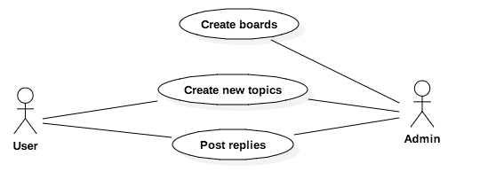

# Model Example

原文<href>https://simpleisbetterthancomplex.com/series/2017/09/11/a-complete-beginners-guide-to-django-part-2.html<href>

## Introduction

我們的項目是一個討論區（一個論壇）。 整個想法是維護幾個板，其行為類似於類別。 然後，在特定的板內，用戶可以通過創建新主題來開始新的討論。 在本主題中，其他用戶可以參與討論發布回覆。 
我們需要找到一種方法來區分常規用戶和管理員用戶，因為只有管理員應該創建新的主板。 下面是我們主要用例的概述以及每種用戶的角色： 

## Class Diagram
從用例圖中，我們可以開始考慮項目的實體。 實體是我們將創建的模型，它與我們的Django應用程序將處理的數據密切相關。

為了能夠實現上一節中描述的用例，我們需要至少實現以下模型：Board，Topic，Post和User。