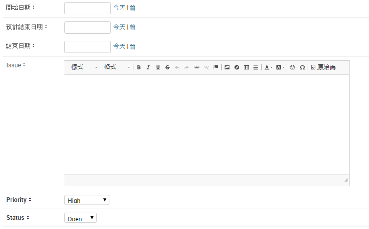
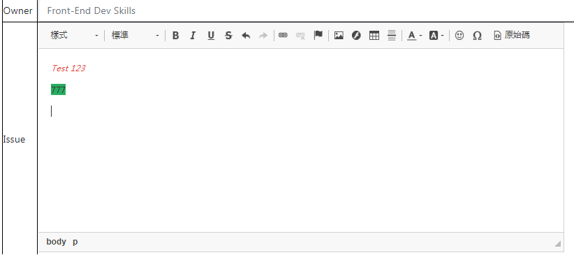

# Django-ckeditor


## 安裝

<a href ="http://www.jishuwen.com/d/2IGy/zh-tw">詳情可以參考這篇</a>
首先在cmd 執行

```
    pip install django-ckeditor
```

安裝成功後在setting.py 註冊

```python
INSTALLED_APPS = [   
    'django.contrib.admin',
    'django.contrib.auth',
    'django.contrib.contenttypes',
    'django.contrib.sessions',
    'django.contrib.messages',
    'django.contrib.staticfiles',  
    'ckeditor',     
]
```


## 修改模型

將原模型 models.TextField 改成RichTextField

```python
from ckeditor.fields import RichTextField
class Task(models.Model): 
    ....    
    #issue=models.TextField(max_length=2000,blank=True,default="")   
    issue=RichTextField(max_length=2000,blank=True,default="") 
```

修改模型後要遷移資料

```
  python manage.py makemigrations
  python manage.py migrate
```
## admin顯示

首先admin.py註冊
```
from django.contrib import admin
from .models import Tasks
admin.site.register(Task)
```

結果


## 前台顯示
html 
```
{{form.issue}}
```

結果</br>



