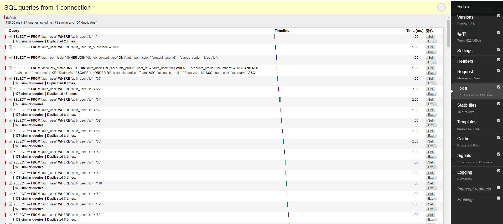

# Django-ckeditor

<a href="https://django-filter.readthedocs.io/en/master/">官方教學</a>


## Install

首先在cmd 執行

```
    django-debug-toolbar
```


## Setting.py

```python
DEBUG = True
IP ='your_ip'
ALLOWED_HOSTS = [IP]
INTERNAL_IPS = [  
    IP,    
]
```

INSTALLED_APPS 加入debug_toolbar

```python
INSTALLED_APPS = [   
    'django.contrib.admin',
    'django.contrib.auth',
    'django.contrib.contenttypes',
    'django.contrib.sessions',
    'django.contrib.messages',
    'django.contrib.staticfiles',  
    'django_filters', 
    'debug_toolbar',    
]
```

MIDDLEWARE 加入

```
MIDDLEWARE = [
    'debug_toolbar.middleware.DebugToolbarMiddleware',
    ...
]

```

## url.py文件添加

```python
if settings.DEBUG:
    import debug_toolbar
    urlpatterns += [
        path('__debug__/', include(debug_toolbar.urls)),

    ] 

```
## Result





