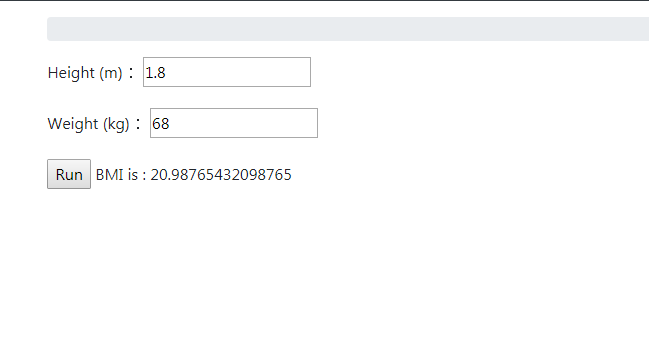

# View


## Simple View 

views.py
```python 

from django.http import HttpResponse

def home_page(request):
    return HttpResponse("Hello World!")  
```


urls.py
```python 
from . import views

urlpatterns = [
    # path函数将url映射到視圖
    path('HonePage/', views.home_page, name='home_page'),
]
```

## Example 

假設我們想建立一個計算BMI 的網頁,這邊先不使用django form 和model.form

html 
```
<form enctype="form-data" action="" method="post">
	
	Height : <input type="number" name="Height" required>
	Weight : <input type="number" name="Weight" required>	
	<input type="submit" class="btn btn-primary" value="Calculate">
</form>
```

```python 
from .forms import BMIForm
def BMI(request):	    
    if request.method == 'POST':        
        Height = request.POST.get('category',None) 
        Weight = request.POST.get('reason',None)            
        bmi = Weight/ (Height*Height)       	    
        return render(request, 'BMI.html', {'bmi':bmi})		        
    else:        
        return render(request, 'BMI.html')		
```

一樣在urls.py新增對應
```
urlpatterns = [   
    path('BMI/', views.BMI, name='BMI'),	
]
```
網頁顯示


## 使用forms.py
這邊可能看不出使用forms 的好處,但forms 的好處是可以搭配CBV

```python 
from django import forms
			 
class BMIForm(forms.Form):
    Height  = forms.FloatField(label='Height (m)', required=True)
    Weight = forms.FloatField (label='Weight (kg)', required=True)
```

這邊注意一下使用form和不使用form 取値方式


views.py
```python
from .forms import BMIForm
def BMI(request):	
    form = BMIForm()  
    if request.method == 'POST':
        form = BMIForm(request.POST)	
        if form.is_valid():             
            Height = form.cleaned_data.get('Height')         
            Weight = form.cleaned_data['Weight']
            bmi = Weight/ (Height*Height)       	    
            return render(request, 'BMI.html', {'form': form,'bmi':bmi})		        
    else:        
        return render(request, 'BMI.html', {'form': form})
```


BMI.html
```html
<form enctype="multipart/form-data" action="" method="post">
    
    {{form.as_p}}	
    <input type="submit" value="Run">	
	
        BMI is : {{bmi}}
	 	
</form>
```

## 介紹幾個導向網頁的方法

<ul>
    <li>HttpResponse:回傳文字</li>
    <li>render(request, template,context)</li>
    <li>redirect(url_name,*args)</li>
</ul>


